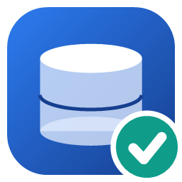
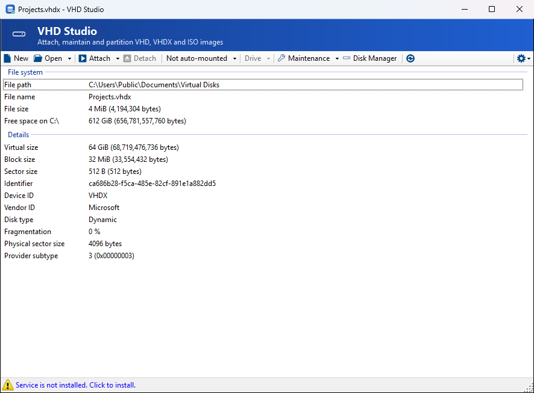
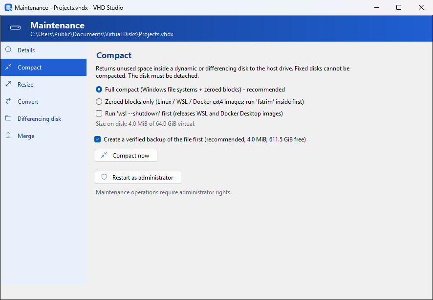
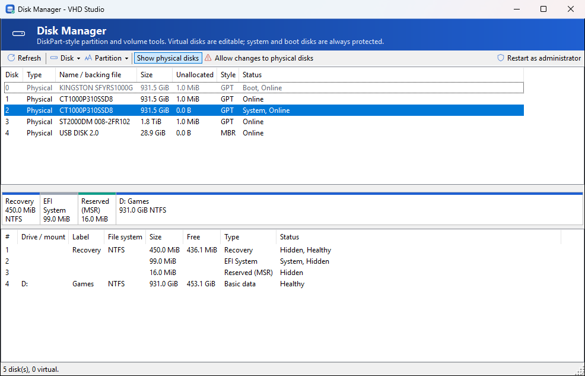

<p align="center">
  
</p>

<h1 align="center">VHD Studio</h1>

<p align="center">
  <b>Attach, maintain and partition VHD, VHDX and ISO images on any Windows edition. No Hyper-V and no scripts needed.</b>
</p>

<p align="center">
  
</p>

VHD Studio is a free, open-source Windows utility for working with virtual disk
files. It adds **Attach / Detach** to the Explorer right-click menu, re-attaches
your disks automatically at startup, and includes a **Maintenance** window and a
DiskPart-style **Disk Manager**. Together they cover the jobs that otherwise need
the Hyper-V PowerShell module (missing on Windows Home), `diskpart` scripts or
Disk Management.

VHD Studio is developed by **Tobias Gundhus ([xGND Software](https://github.com/tgundhus))**.

> **Credits:** VHD Studio is based on **[VHD Attach](https://github.com/medo64/VhdAttach)** by
> **Josip Medved ([@medo64](https://github.com/medo64))**, who created it and maintained versions
> 1.0 to 4.22 from 2009 to 2020. The attach/detach engine, auto-mount service and much of the
> code are his work, released under the MIT license. Thank you, Josip! For the classic tool,
> visit [medo64.com/vhdattach](https://www.medo64.com/vhdattach/).


## Features

### Attach & auto-mount
* Attach / detach from Explorer's context menu (VHD, VHDX, ISO), read-only if you like.
* **Auto-mount at startup** through a small Windows service: read-only, no drive letter, or
  **mounted into an empty folder** instead of a drive letter (folder mounts require an administrator).
* Users without admin rights can attach disks, because the service does the privileged work.
  The service checks the user's own permissions first, so nobody can attach a file they couldn't open themselves.
* **VHDX log replay.** A VHDX that wasn't closed cleanly (crash, power loss) normally fails with a
  confusing *"Access denied"*. VHD Studio detects the pending log and replays it for a normal attach.
  A read-only attach never writes to the file; it explains the problem and points you to
  Repair → Replay log, which takes a backup first.
* **Safe detach.** Volumes are flushed and locked before a disk is detached. If files are still open,
  you get the choice to retry instead of losing unsaved data.
* Mapped network drives are translated to UNC paths so the service can reach them.

### Maintenance (no Hyper-V required)



| Task | What it does |
|---|---|
| **Compact** | Returns free space to the host. Full (NTFS/ReFS-aware) or zeroed-blocks-only mode for WSL / Docker `ext4.vhdx`, with optional `wsl --shutdown`. Shows the before/after size. |
| **Resize** | Grow VHD/VHDX, or shrink VHDX down to the smallest safe size. |
| **Convert** | VHD ↔ VHDX, dynamic ↔ fixed, 512 / 4K logical sectors. The source file is never modified. |
| **Differencing disk** | Create a child disk to experiment safely. Merge it back later, or delete it to discard the changes. |
| **Merge** | Merge a differencing (child) disk into its parent. |
| **Repair** | Replay the VHDX log, fix a broken parent path (`Set-VHD -ParentPath` equivalent), or reset a duplicate disk identifier. |
| **Details** | Type, virtual / on-disk size, fragmentation, sector sizes, smallest safe size, parent chain. |

Every operation that changes an existing file first shows exactly what will change and makes a
**verified backup** (checksum re-read from disk) (enabled by default when there is room). It refuses disks that are attached
or in use, and checks the result afterwards. Long operations show progress, and those that are
safe to interrupt can be cancelled.

### Disk Manager (DiskPart GUI)



* Lists disks, partitions and volumes. Virtual disks are highlighted and shown with their backing file.
* Initialize (GPT/MBR) and convert partition style.
* Create, format (NTFS, ReFS, exFAT, FAT32), extend/shrink and delete partitions.
* Assign or remove drive letters, and mount volumes in folders.
* Online/offline, read-only, active flag, and clean.
* Retrim free space before compacting, and scan or spot-fix the file system.
* **Safety first:**
  * The system and boot disks can never be changed.
  * Physical disks are read-only until you explicitly unlock them.
  * Destructive actions require typed confirmation.
  * Every change shows the **equivalent PowerShell command** before it runs.

Disk Manager is available from the toolbar (`Ctrl+D`), the Start menu, or `VhdStudio.exe /DiskManager`.


## Data safety

VHD Studio is built so that you don't lose data by accident. It never replaces existing files, makes
verified backups before in-place changes, protects system, boot, page-file and image-hosting disks,
re-checks every disk before changing it, refuses to touch volumes with open files, and logs every
change to `%ProgramData%\xGND Software\VHD Studio\Logs`. The full model is in [docs/SAFETY.md](docs/SAFETY.md).
An end-to-end test suite verifies the data on real virtual disks byte for byte after every operation.


## Installation

Download one of the installers from [Releases](https://github.com/tgundhus/VHD-Studio/releases):

| Installer | Size | Use it when |
|---|---|---|
| `vhdstudio-<version>-setup-standalone.exe` | ~36 MB | You just want it to work. .NET is embedded, so there's nothing else to install. |
| `vhdstudio-<version>-setup.exe` | ~2.4 MB | You manage machines centrally. Uses the shared [.NET 10 Desktop Runtime (x64)](https://dotnet.microsoft.com/download/dotnet/10.0), which Windows Update, WSUS or Intune keep patched. Setup checks for it and links to the download if it's missing. |

Upgrading from **VHD Attach 4.x**: setup removes the old version and its service automatically and
keeps your auto-mount list.

Requires Windows 10 1809 or later, or Windows 11 (x64). Works on Home, Pro and Enterprise.


## Shortcut keys

| Key | Action |
|---|---|
| `F5` | Refresh |
| `F6` | Attach |
| `Ctrl+N` | New virtual disk |
| `Ctrl+O` | Open file |
| `Ctrl+D` | Disk Manager |
| `Alt+T` | Maintenance menu |
| `Alt+A` | Attach menu |
| `Alt+D` | Detach |
| `Alt+M` | Auto-mount menu |
| `Alt+O` | Recent files |
| `Ctrl+A` / `Ctrl+C` | Select all / copy details |


## Command line

```text
VhdStudio.exe "disk.vhdx"                           Open a disk
VhdStudio.exe /attach [/readonly] "disk.vhdx"       Attach (read-only)
VhdStudio.exe /detach "disk.vhdx"                   Detach
VhdStudio.exe /detachdrive "X:"                     Detach the virtual disk behind a drive letter
VhdStudio.exe /changeletter "disk.vhdx" "Y:"        Set the drive letter of an attached disk
VhdStudio.exe /maintain "disk.vhdx" [/task=Compact] Open Maintenance (Details, Compact, Resize,
                                                    Convert, Differencing, Merge, Repair)
VhdStudio.exe /diskmanager [/disk=N]                Open Disk Manager
```


## Building

See [BUILD.md](BUILD.md). In short: `dotnet test Source\VhdStudio.sln`, then `Setup\Publish.ps1`.


## Roadmap

The market analysis and the prioritized feature proposal are in [docs/PROPOSAL.md](docs/PROPOSAL.md).
Bug reports and ideas are welcome in [Issues](https://github.com/tgundhus/VHD-Studio/issues).


## License

[MIT](LICENSE.md). VHD Studio © 2026 Tobias Gundhus, xGND Software. Based on VHD Attach © 2009-2020 Josip Medved.
